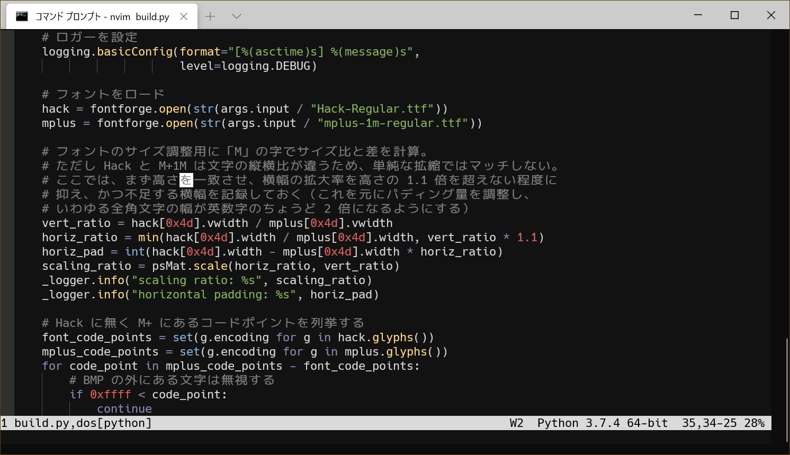

# HM Font

Adds Japanese Characters to the Hack Font. (Combined with Fira Code Ligatures)
[Hack](https://sourcefoundry.org/hack/), a typeface in the Bitstream Vera lineage.
[M+ 1m](https://mplus-fonts.osdn.jp/) japanese glyphs

## Screenshot

